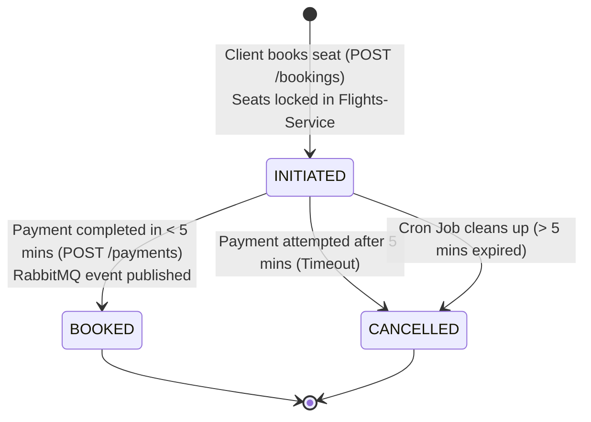
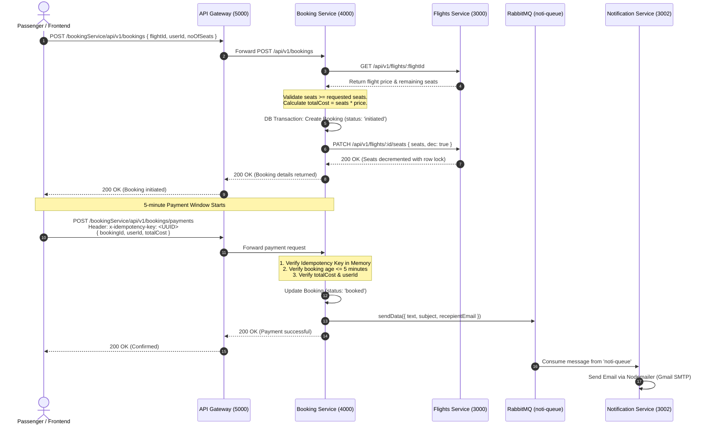
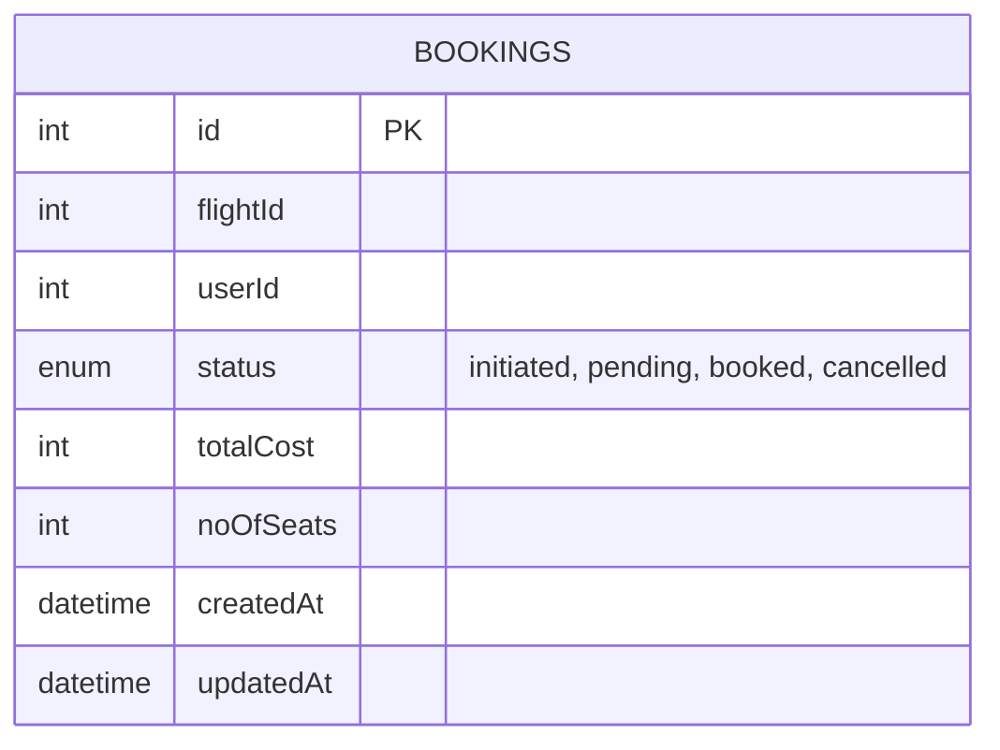

# Flight Booking Service (`Flight-Booking-Service`)

The **Flight Booking Service** manages the lifecycle of flight reservations, orchestrates distributed seat reservations with the Flights Service, enforces payment idempotency, schedules automatic cancellation for abandoned bookings, and dispatches asynchronous confirmation events via **RabbitMQ**.

---

## 1. Tech Stack & Dependencies

- **Runtime & Framework:** Node.js (v18+), Express.js (`^5.2.1`)
- **HTTP Client (Inter-Service RPC):** Axios (`^1.19.0`)
- **Message Broker:** RabbitMQ via `amqplib` (`^2.0.1`)
- **Background Job Scheduler:** `node-cron` (`^4.6.0`)
- **ORM & Database:** Sequelize (`^6.37.8`), `sequelize-cli` (`^6.6.5`), MySQL (`mysql2` `^3.22.5`)
- **Logging & Utilities:** Winston (`^3.19.0`), `http-status-codes` (`^2.3.0`), `dotenv` (`^17.4.2`)

---

## 2. Distributed Booking State Machine & Saga Flow

A booking transitions through four states: `INITIATED` $\rightarrow$ `BOOKED`, or expires into `CANCELLED`.



### Complete End-to-End Distributed Sequence



---

## 3. Key Design Patterns & Guarantees

### 1. Payment Idempotency (`x-idempotency-key`)
To avoid double charging when network timeouts or accidental double clicks occur:
- Clients must provide a unique header: `x-idempotency-key: <unique-uuid>`.
- The controller tracks processed keys in an in-memory registry:
  - If a key has already been processed: rejects with `400 Bad Request: Cannot retry on a successful payment`.
  - If the header is missing: rejects with `400 Bad Request: idempotency key missing`.

### 2. Time-Bounded Seat Hold (5-Minute Expiry)
- When a booking is created, seats are temporarily subtracted from the Flights Service.
- The passenger has **5 minutes (300,000 ms)** to complete payment.
- If payment is attempted at $T > 5 \text{ min}$:
  1. The booking is marked `CANCELLED`.
  2. A compensatory call is made to Flights Service: `PATCH /api/v1/flights/:id/seats` with `{ seats, dec: 0 }` to return the held seats back to inventory.
  3. The request is rejected with `The booking has expired`.

### 3. Background Reconciliation Cron Job
- Scheduled via `node-cron` to run every 30 minutes (`*/30 * * * *`).
- Scans the MySQL database for orphaned bookings that remain in non-terminal states (`!= BOOKED` and `!= CANCELLED`) created more than 5 minutes prior, automatically transitioning them to `CANCELLED`.

### 4. Asynchronous Event Publishing
- Connected to RabbitMQ at `amqp://localhost` upon service startup.
- Publishes confirmation payloads to the queue named `noti-queue`.

---

## 4. Database Schema

The service manages the `Bookings` table:



- **`flightId`** (INTEGER, Required): Identifier of the flight booked.
- **`userId`** (INTEGER, Required): Identifier of the passenger.
- **`status`** (ENUM, Default: `'initiated'`): Reservation status (`initiated`, `pending`, `booked`, `cancelled`).
- **`totalCost`** (INTEGER, Required): Calculated total price for all seats.
- **`noOfSeats`** (INTEGER, Default: 1): Number of reserved seats.

---

## 5. Environment Variables & Setup

Create a `.env` file in `Flight-Booking-Service/`:

```env
PORT=4000
FLIGHT_SERVICE=http://localhost:3000
```

### Database Configuration (`src/config/config.json`)
```json
{
  "development": {
    "username": "root",
    "password": "your_db_password",
    "database": "Flight_Booking_Dev",
    "host": "127.0.0.1",
    "dialect": "mysql"
  }
}
```

---

## 6. API Route Catalog & Endpoints

### 1. Create Flight Booking
- **Method & Route:** `POST /api/v1/bookings`
- **Access:** Direct / Proxied via Gateway (`/bookingService/api/v1/bookings`)
- **Description:** Verifies seat capacity on Flights Service, calculates total billing, records reservation, and holds seats.
- **Request Body:**
  ```json
  {
    "flightId": 1,
    "userId": 2,
    "noOfSeats": 2
  }
  ```
- **Success Response (`200 OK`):**
  ```json
  {
    "success": true,
    "message": "Successfully completed the request",
    "data": {
      "id": 14,
      "flightId": 1,
      "userId": 2,
      "status": "initiated",
      "noOfSeats": 2,
      "totalCost": 10800,
      "updatedAt": "2026-09-26T01:20:00.000Z",
      "createdAt": "2026-09-26T01:20:00.000Z"
    },
    "error": {}
  }
  ```
- **Error Responses:**
  - `400 Bad Request`: `Not enough seats available`.
  - `500 Internal Server Error`: Downstream flight service failure or DB transaction abort.

---

### 2. Process Payment & Confirm Booking
- **Method & Route:** `POST /api/v1/bookings/payments`
- **Access:** Direct / Proxied via Gateway
- **Headers:**
  - `x-idempotency-key: 9b1deb4d-3b7d-4bad-9bdd-2b0d7b3dcb6d` (Required unique string)
- **Request Body:**
  ```json
  {
    "bookingId": 14,
    "userId": 2,
    "totalCost": 10800
  }
  ```
- **Success Response (`200 OK`):**
  ```json
  {
    "success": true,
    "message": "Successfully completed the request",
    "data": true,
    "error": {}
  }
  ```
- **Error Scenarios & Responses:**
  - `400 Bad Request`: `idempotency key missing`
  - `400 Bad Request`: `Cannot retry on a successful payment`
  - `400 Bad Request`: `The booking has expired` (Triggers seat restoration)
  - `400 Bad Request`: `The amount of the payment doesnt match`
  - `400 Bad Request`: `The user corresponding to the booking doesnt match`

---

### 3. Service Health Check
- **Method & Route:** `GET /api/v2/info`
- **Response (`200 OK`):**
  ```json
  {
    "message": "coming from v2 api"
  }
  ```

---

## 7. Setup & Execution

### Prerequisites
1. **RabbitMQ Broker:** Must be running locally on default port `5672` (`amqp://localhost`).
2. **Flights Service:** Must be running on `http://localhost:3000`.

### 1. Install Dependencies
```bash
cd Flight-Booking-Service
npm install
```

### 2. Run Database Migrations
```bash
npx sequelize db:migrate
```

### 3. Start Development Server
```bash
npm run dev
```
Upon startup, the server prints:
```text
Server is running on port 4000
connected to queue
```